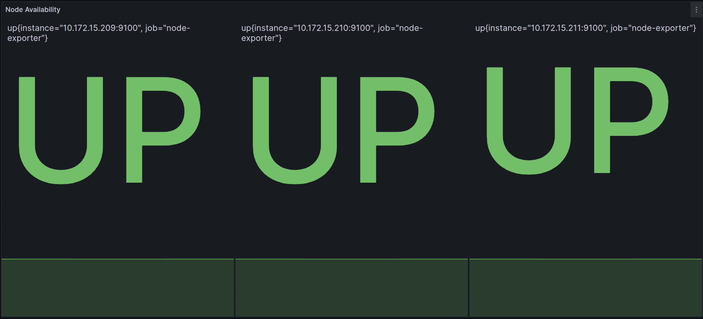
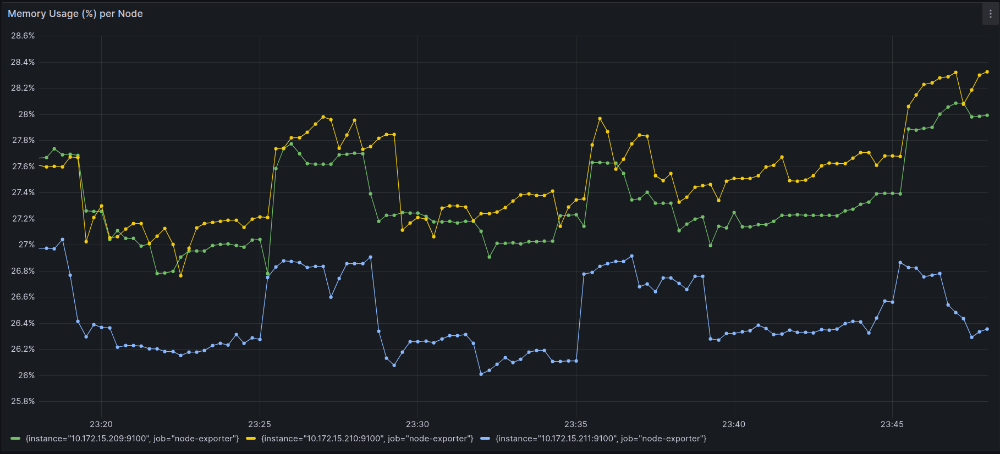
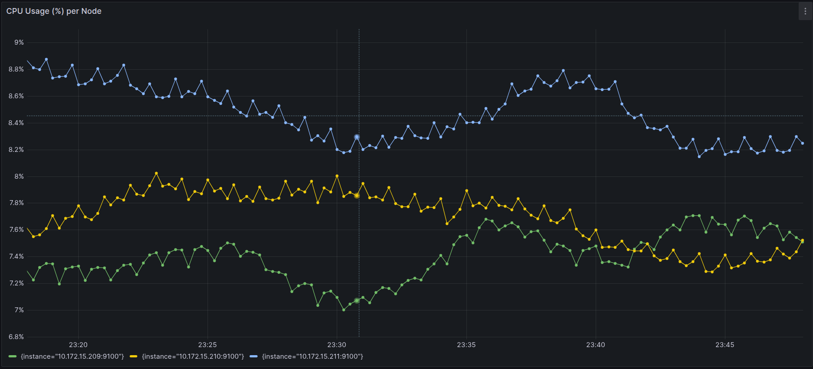
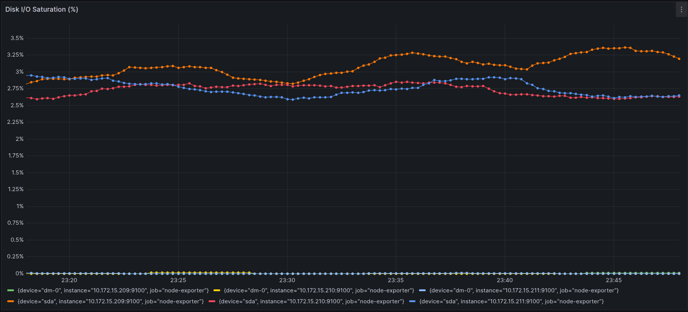
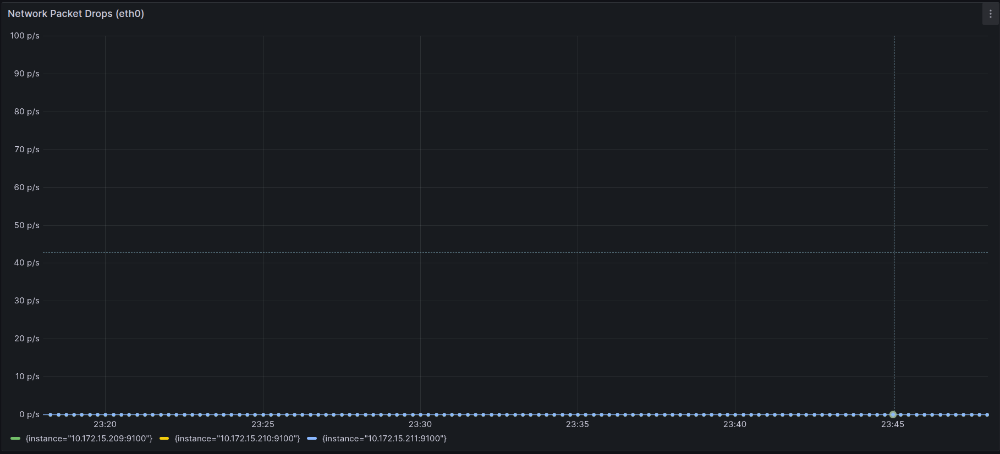
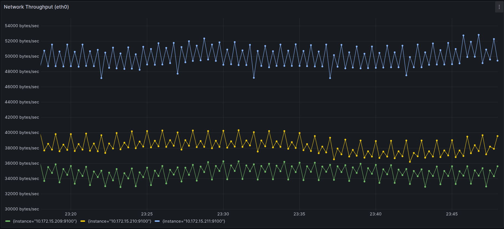

# Monitoring the Application and the Infrastructure

## Purpose of This Document
This document describes the monitoring setup implemented for the Online Boutique application deployed on Google Kubernetes Engine (GKE).
The document explains:

  1. Monitoring Scope and Metrics.
  2. The architecture of the monitoring setup.
  3. The rationale behind each component.
  4. How to deploy the setup we developed.
  5. Baseline measurments.

**We assume everything is done on `google cloud shell`**

---

## 1. Monitoring Scope and Metrics.

The monitoring setup is designed to observe the system at **`two complementary`** levels: the infrastructure (`nodes`) and the application (`pods and microservices`), allowing clear attribution of performance behavior and avoid mistaking resource saturation with application-level inefficiencies.

### 1.1. Node-Level Metrics
- Node-level metrics describe resource consumption at the level of the worker node as a whole, including the host operating system, Kubernetes system components, and application workloads.
- The following node-level metrics are collected:
  
  - **CPU utilization** :  Percentage of total CPU capacity used per node.
  - **Memory utilization**: Fraction of total memory in use, derived from available and total memory.
  - **Disk I/O activity**:
    - Disk I/O saturation (percentage of time the disk is busy).
    - Disk throughput (read and write bytes per second).
  - **Network activity** :
    - Network throughput.
    - Network packet drops.
 
### 1.2. Pod- and Microservice-Level Metrics
- Pod- and microservice-level metrics provide visibility into how individual application components consume resources.
  
- The following metrics are collected at this level:

  - **CPU usage** per pod and per microservice

  - **Memory consumption** per pod and per microservice

  - **Resource distribution** across replicas of the same microservice (If replicas do exist).


These metrics allow attribution of resource usage to specific application components, detection of uneven load distribution across pods and correlation between application behavior and infrastructure-level pressure

---

## 2. Node-Level Monitoring Deployment Architecture

To collect node-level metrics, we deployed a dedicated monitoring architecture inside the Kubernetes cluster. 

This architecture is composed of three main components—Node Exporter, Prometheus, and Grafana—each serving a distinct role in the metric collection and visualization pipeline.

### 2.1. Node Exporter Deployment

- Node Exporter is a Prometheus exporter that exposes host-level metrics from the operating system, such as CPU usage, memory consumption, disk I/O, and network activity.

- To ensure complete coverage of the cluster, Node Exporter is deployed as a **`DaemonSet`**, which guarantees that `one instance` runs on each worker node. This design allows metrics to be collected directly from the host system on every node, independently of the application pods scheduled on it.

- Each Node Exporter instance exposes metrics over HTTP, which are later scraped by Prometheus.

### 2.2. Prometheus Deployment

- Prometheus is deployed inside the cluster as a central component responsible for scraping, storing, and querying metrics exposed by Node Exporter.

- Prometheus is configured to use `Kubernetes service discovery` to automatically detect `Node Exporter instances` running on each node,thus avoids hard-coded endpoints and allowing the monitoring system to adapt dynamically to changes in cluster size or topology.

- Prometheus plays a critical role by: Periodically scraping metrics from Node Exporter, Storing time-series data efficiently, and Providing a query language (PromQL) to aggregate and analyze metrics.

### 2.3. Grafana Deployment

- Grafana is deployed inside the cluster to provide `visualization and dashboarding` capabilities on top of the metrics collected by Prometheus.

- Grafana is configured to use Prometheus as its data source and allows metrics to be explored and visualized through interactive dashboards. For this project, we defined `custom dashboards` using a JSON specification.

### 2.4. Namespace Isolation and Repository Structure

- All monitoring components are deployed in the `monitoring` namespace to clearly separate monitoring infrastructure from application workloads reduce the risk of configuration and to simplify deployment and teardown procedures.

- The Kubernetes manifests, Grafana dashboard JSON files, and the Makefile used to deploy the monitoring stack are located in the following directory: `microservices-demo/monitoring`

- The exact commands and procedures required to deploy and access these components are described in a dedicated **`Deployment and Usage section`**.

---

## 3. Deployment of node-level monitoring stack

All deployment artifacts of the monitoring stack are located in: `microservices-demo/monitoring`

### 3.1. Deploying Node-Exporter and Prometheus

- Deployment is automated using a Makefile: From the `microservices-demo/monitoring` directory, run:
  ```bash
  make apply
  ```
- Running `make apply` performs the following operations:

  - Create the monitoring namespace: The namespace is created only if it does not already exist, allowing repeated executions without errors.

  - Deploy Node Exporter: Node Exporter is deployed as a DaemonSet, ensuring one exporter instance runs on each worker node.

  - Deploy Prometheus: Prometheus is deployed with Kubernetes-based service discovery and configured to scrape node-level metrics from Node Exporter.

- After deployment, check that the pods are up and running:
  ```bash
  kubectl get pods -n monitoring
  ```

### 3.2. Accessing Prometheus (Google Cloud Shell)

- Prometheus is exposed internally via a ClusterIP service and must be accessed using port forwarding.

- Run the following command:
  ```bash
  kubectl port-forward -n monitoring svc/prometheus 9090:9090
  ```

- Then, in Google Cloud Shell:
  - Click `Web Preview`
  - Select Preview on `port 9090`

### 3.3. Accessing Grafana (Local Machine)

- Grafana cannot be reliably accessed through Google Cloud Shell’s Web Preview feature.
  
- Cloud Shell exposes services through a sandboxed proxy domain, which is rejected by Grafana’s strict browser origin security policies. As a result, certain Grafana features (such as dashboard imports from grafana.com) do not work correctly in this environment.

- For this reason, Grafana must be accessed from a local machine by port-forwarding the service and opening it via `http://localhost:3000`, which is a trusted origin.

- Start by deploying `Grafana` on the cluster on `Google Cloud shell` inside the `monitoring` directory:
  ```bash
  kubectl apply -n monitoring -f grafana.yaml
  ```

- First, we need to allow kubectl to authenticate with GKE from a local machine and so the GKE authentication plugin must be installed. Run the following commands on your machine:
  ```bash
  sudo apt-get update
  sudo apt-get install google-cloud-sdk-gke-gcloud-auth-plugin
  ```
- Second, tell kubectl to use the plugin:
  ```bash
  echo 'export USE_GKE_GCLOUD_AUTH_PLUGIN=True' >> ~/.bashrc
  source ~/.bashrc
  ```
- Third, reconnect to the cluster:
  ```bash
  gcloud container clusters get-credentials prodigy-cluster \
  --zone europe-west6-a \
  --project cloud-computing-478110
  ```
- Fourth: Once local access is configured, expose Grafana using port forwarding:
  ```bash
  kubectl port-forward -n monitoring svc/grafana 3000:3000
  ```

- You can now access the Grafana UI, with both username and password being `admin`:
  ```bash
  http://localhost:3000
  ```
  The `dashboard JSON file` is located in the monitoring directory and can be imported directly into Grafana.

  ---


## 4. Baseline Evaluation — Node-Level Metrics

This section presents the baseline evaluation of node-level infrastructure metrics collected using Prometheus and visualized with Grafana. The objective is to validate that the monitoring stack is correctly deployed and that the cluster operates within expected resource usage limits under no artificial load.


### 4.1 Node Availability (UP/DOWN)



- This panel displays the `up{job="node-exporter"}` metric for each node. All three nodes report a value of `1` (UP), indicating that Prometheus can successfully scrape the Node Exporter on every VM.

- **Interpretation**
  - All nodes in the GKE cluster are reachable and exporting metrics correctly.  
  - No scrape failures, restarts, or availability issues are observed.

---

### 4.2 Memory Usage (%) per Node


 
- This line chart displays the percentage of memory used on each node over time.

- **Interpretation**  
  - Memory usage remains stable across all nodes (approximately 26–28%).  
  - Small fluctuations correspond to normal system activity such as container scheduling and OS background processes.  
  - No signs of memory leaks or abnormal growth are observed.

---

### 4.3. CPU Usage (%) per Node



- CPU usage per node, aggregated using:

```promql
sum by (instance) (
  rate(node_cpu_seconds_total{mode!="idle"}[5m])
)
```

- **Interpretation**
  - CPU utilization remains low (around 7–9%), indicating limited load at baseline.  
  - One node consistently exhibits slightly higher CPU usage, which may indicate uneven workload distribution by the Kubernetes scheduler.  
  - No CPU saturation or bottlenecks are detected.

---

### 4.4. Disk Throughput (Read + Write)


 
- Disk read and write throughput per node, expressed in kB/s.

- **Interpretation**  
  - Throughput remains in the 480–500 kB/s range across nodes.  
  - Short-lived spikes correspond to normal pod activity such as temporary file access.  
  - No sustained high disk activity or I/O-intensive workloads are observed.

---

### 4.5. Disk I/O Saturation (%)



- Percentage of time the disk spends servicing I/O requests.

- **Interpretation**  
  - Disk I/O saturation remains very low (approximately 2.5–3.5%).  
  - No disk queue buildup or contention is present.  
  - The storage subsystem is operating well below its performance limits.

---

### 4.6. Network Packet Drops (eth0)



- Number of dropped packets per second on the primary network interface of each node.

- **Interpretation**  
  - Packet drops remain at 0 p/s for all nodes throughout the observation period.  
  - This indicates stable networking with no congestion, packet loss, or retransmissions.

---

### 4.7. Network Throughput (eth0)



- Total inbound and outbound network traffic per node.

- **Interpretation**  
  - Network throughput ranges from approximately 32 kB/s to 52 kB/s depending on the node.  
  - One node consistently handles more traffic, possibly due to hosting more services or control-plane-related communication.  
  - No abnormal spikes or instability are observed.

---

## 4.8 Baseline Summary

The baseline measurements confirm that the monitoring infrastructure is correctly deployed and functioning as expected.  
All nodes operate well within safe resource limits, with no signs of contention, saturation, or instability.  
This validated baseline serves as a reference point for subsequent performance evaluations under load, including pod-level metrics and application stress testing using Locust.

