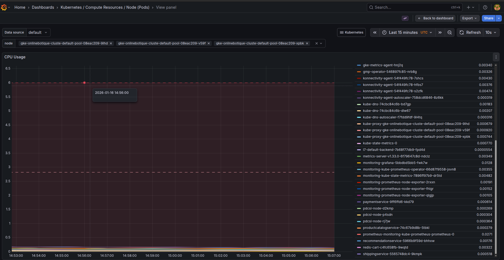
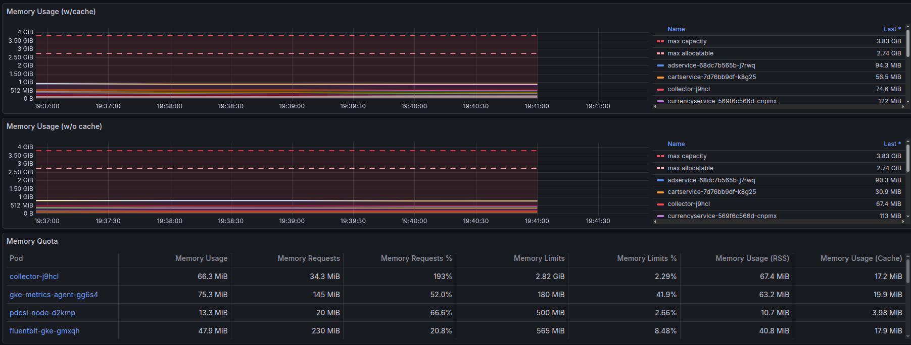
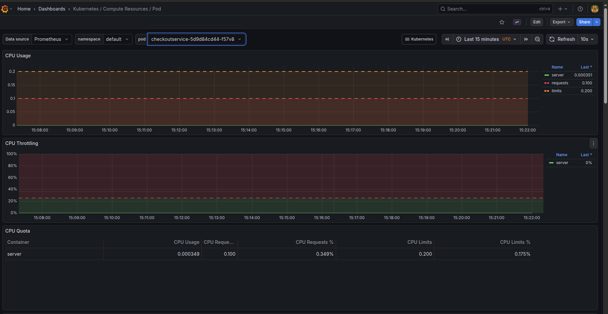
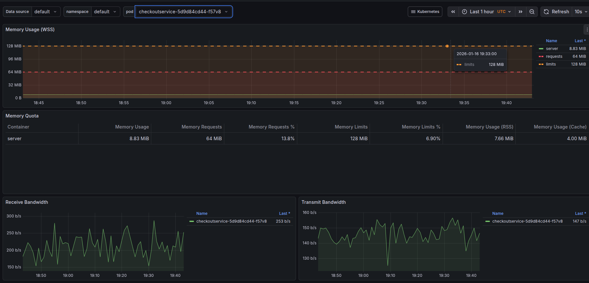
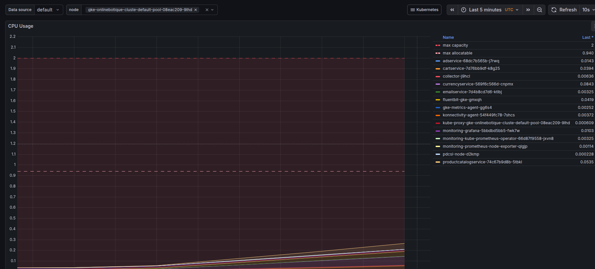
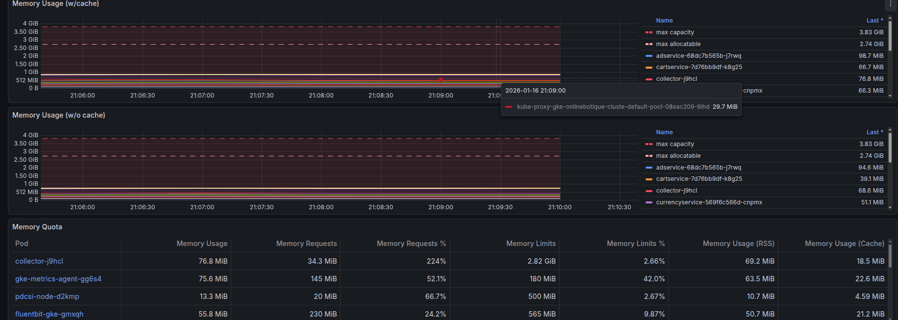
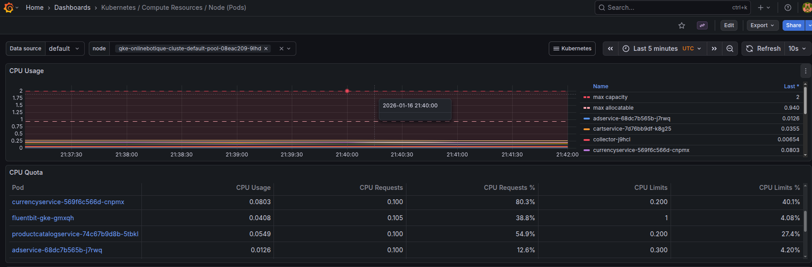
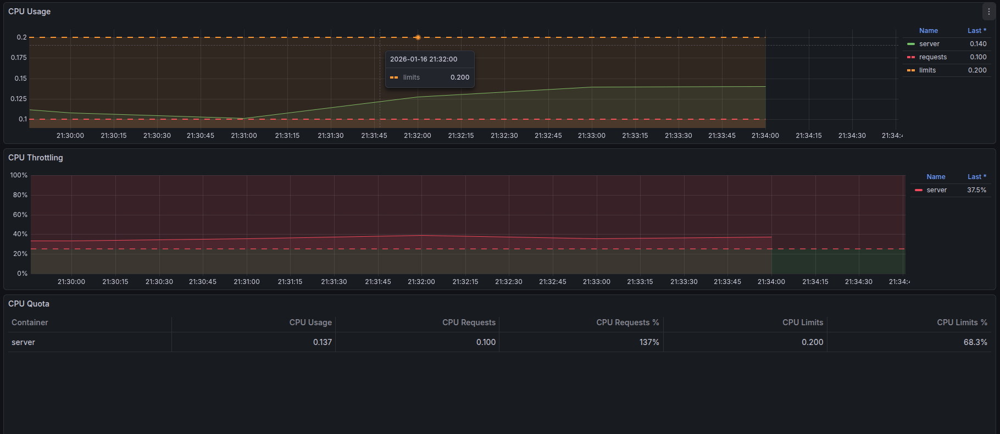
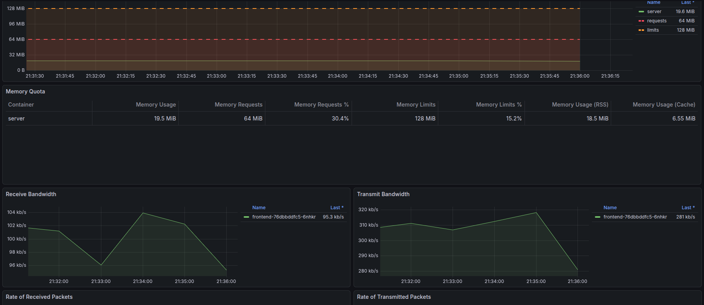
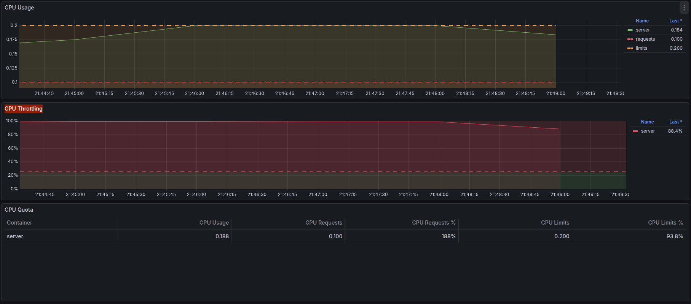

## 0. Done By:

- Jad Salameh
- Ahmad Ghandour

## 1. Cloud Provider

This lab was conducted on **Google Cloud Platform (GCP)**, which served as the target execution environment. A **dedicated GCP project** was created specifically for the experiments.


## 2. Kubernetes Cluster Setup

The Kubernetes cluster was deployed using **Google Kubernetes Engine (GKE)** in **standard mode**.

The standard mode was deliberately chosen over **Autopilot mode** in order to retain **full control over cluster configuration**.

In contrast, **Autopilot mode** abstracts away node management and automatically provisions resources. While convenient, this abstraction hides the impact of misconfigured resource requests and limits the pedagogical value of experiments centered on resource management.


## 3. Cluster Configuration

### 3.1. Creating the cluster 

To ensure a consistent and repeatable setup, a shell script was used to automate the creation and configuration of the GKE cluster.
The script provisions a new Kubernetes cluster using default GKE settings.

```bash
set -euo pipefail

# ============================
# Configuration
# ============================
PROJECT_ID="cloud-computing-478110"
REGION="europe-west6"
ZONE="europe-west6-a"
CLUSTER_NAME="prodigy-cluster"

echo "Setting GCP project"
gcloud config set project "$PROJECT_ID"

echo "Setting default region"
gcloud config set compute/region "$REGION"

echo "Setting default zone"
gcloud config set compute/zone "$ZONE"

echo "Creating GKE cluster: $CLUSTER_NAME"
gcloud container clusters create "$CLUSTER_NAME"

echo " Fetching cluster credentials"
gcloud container clusters get-credentials "$CLUSTER_NAME"

echo "Cluster nodes:"
kubectl get nodes
```
---

### 3.2. Cluster Environment Overview

▶ We start by running this command to get information about the `worker` nodes of this cluster: 
```bash
kubectl get nodes -o wide
```

<pre>
NAME                                             STATUS   ROLES    AGE     VERSION               INTERNAL-IP   EXTERNAL-IP     OS-IMAGE                             KERNEL-VERSION   CONTAINER-RUNTIME
gke-prodigy-cluster-default-pool-30fddad3-bf4k   Ready    &lt;none&gt;   8m40s   v1.33.5-gke.1308000   10.132.0.15   34.22.190.69    Container-Optimized OS from Google   6.6.105+         containerd://2.0.6
gke-prodigy-cluster-default-pool-30fddad3-bllw   Ready    &lt;none&gt;   8m39s   v1.33.5-gke.1308000   10.132.0.16   34.22.254.228   Container-Optimized OS from Google   6.6.105+         containerd://2.0.6
gke-prodigy-cluster-default-pool-30fddad3-m1br   Ready    &lt;none&gt;   8m40s   v1.33.5-gke.1308000   10.132.0.17   35.187.27.7     Container-Optimized OS from Google   6.6.105+         containerd://2.0.6
</pre>


▶ We now run the command below to display the **`total`** hardware CPU and memory capacity of each node.
```bash
kubectl get nodes \
  -o custom-columns=NAME:.metadata.name,CPU:.status.capacity.cpu,MEMORY:.status.capacity.memory
```
<pre>
NAME                                             CPU   MEMORY
gke-prodigy-cluster-default-pool-30fddad3-bf4k   2     4015664Ki
gke-prodigy-cluster-default-pool-30fddad3-bllw   2     4015664Ki
gke-prodigy-cluster-default-pool-30fddad3-m1br   2     4015664Ki
</pre>

▶ We now run the command below to display the **`allocatable`** (schedulable) CPU and memory for each node.
```bash
kubectl get nodes \
-o custom-columns=NAME:.metadata.name,CPU:.status.allocatable.cpu,MEMORY:.status.allocatable.memory
```
<pre>
NAME                                             CPU    MEMORY
gke-prodigy-cluster-default-pool-30fddad3-bf4k   940m   2869808Ki
gke-prodigy-cluster-default-pool-30fddad3-bllw   940m   2869808Ki
gke-prodigy-cluster-default-pool-30fddad3-m1br   940m   2869808Ki
</pre>

  - Although each node has 2 vCPUs and ~4 GiB of memory, only 940 mCPU and ~2.7 GiB are allocatable per node, with the remaining resources reserved by the system and Kubernetes components.

## 4. Initial Deployment Using the Base Configuration

### 4.1. Deploying the application with `Kustomize`

Google's `microservices-demo` repository already provided the **`Base configuration`** in the `kustomize` Folder.

The base configuration corresponds to the default Kubernetes manifests provided by Google for deploying the Online Boutique application. 
It defines all microservices composing the application, including auxiliary components such as the load generator, using predefined resource requests and limits. 
No changes were applied to this configuration during the initial deployment, allowing the cluster behavior to be observed under the original, unmodified setup.

▶ To deploy Google's Online Boutique microservice architecture application: 

```bash
cd microservices-demo/kustomize/
```
```bash
kubectl kustomize .
```
- The `kubectl kustomize .` command was executed to generate the final Kubernetes manifests derived from the base Kustomize configuration. This command allows the rendered configuration to be inspected before deployment.

```bash
kubectl apply -k .
```
- The application was then deployed using `kubectl apply -k` ., which applies the manifests generated by Kustomize to the Kubernetes cluster.
- After deployment, the state of the application was observed to assess whether all microservices were successfully scheduled on the cluster.
---
### 4.2. Observed Behavior

▶ We start by displaying the state of the pods: 
```bash
kubectl get pods
```
<pre>
NAME                                     READY   STATUS    RESTARTS   AGE
adservice-b4856c769-bbjpd                1/1     Running   0          106m
cartservice-5784f94fb6-pb7d6             1/1     Running   0          106m
checkoutservice-56c5cffd57-smpgs         1/1     Running   0          106m
currencyservice-66c885779c-4cq4p         1/1     Running   0          106m
emailservice-bc487bdb7-p56xh             1/1     Running   0          106m
frontend-5965c589c8-22xnx                1/1     Running   0          106m
loadgenerator-79fb484559-hhpqw           0/1     Pending   0          106m
paymentservice-656fb48df5-c75r2          1/1     Running   0          106m
productcatalogservice-5db55dcfbc-jggml   1/1     Running   0          106m
recommendationservice-7f8c5fcbff-tm7p5   1/1     Running   0          106m
redis-cart-c4fc658fb-nmgxj               1/1     Running   0          106m
shippingservice-7fdc84f79-8h4vp          0/1     Pending   0          106m
</pre>

- The output shows that most microservices were successfully started and reached the `Running` state.
- However, two Pods did not reach the Running state and remained in the `pending` status :
    -  loadgenerator service
    -  shipping service
- At this stage, the deployment did not fully succeed, since not all Pods were scheduled onto worker nodes. The presence of Pods in the Pending state indicates that Kubernetes was unable to place these Pods on any available node in the cluster.
- This observation motivated a deeper investigation of the scheduling behavior and resource constraints of the cluster, which is discussed in the following section.
---
### 4.3. Analysis of the Scheduling Failure
▶ We start by observing the state of the `ShippingService`:
```bash
kubectl describe pod shippingservice-7fdc84f79-8h4vp
```
<pre>
Events:
  Type     Reason             Age                      From                Message
  ----     ------             ----                     ----                -------
  Warning  FailedScheduling   5m23s (x34 over 170m)    default-scheduler   0/3 nodes are available: 3 Insufficient cpu. preemption: 0/3 nodes are available: 3 No preemption victims found for incoming pod.
  Normal   NotTriggerScaleUp  2m35s (x1022 over 175m)  cluster-autoscaler  Pod didn't trigger scale-up:
</pre>

- We observe a warning from the `default-scheduler` stating that the `ShippingService` could not be deployed. The two reasons being: 
    -  Kubernetes was unable to schedule the Pod on any of the available worker nodes due to insufficient allocatable CPU resources
    -  No existing Pods could be preempted to make room for the incoming Pod.
- We also observe from the `cluster-autoscaler` that the pod did not trigger a **`ScaleUp`**  .
    - This behavior is expected, as the cluster was created with a fixed size and autoscaling was not configured to add new nodes.

▶We further inspect the base configuration manifest of the `ShippingService` pod: 
```bash
cd kustomize/base/
cat shippingservice.yaml
```

<pre>
resources:
        requests:
            cpu: 100m
            memory: 64Mi
        limits:
            cpu: 200m
            memory: 128Mi
</pre>
- A **`CPU limit`** represents the maximum amount of CPU time a container is allowed to consume at `runtime` and is enforced by the Linux kernel through cgroup-based throttling
- A **`CPU request`** is the amount of CPU time a container declares so that Kubernetes can decide where the Pod can be scheduled and how CPU time should be fairly shared under contention; it represents a relative weight for CPU access, not a guaranteed continuous allocation.
- When Kubernetes decides whether it can deploy (schedule) a Pod onto a worker node, it considers resource `requests` only.
- kubernetes deploys a pod on a node if and only if this inequality is satisfied :
  <pre>
  (sum of CPU requests of running Pods)+ (CPU request of new Pod)≤(node allocatable CPU)
  </pre>
▶In this case, the `shippingservice` Pod requests `100 millicores` of CPU. Given the limited CPU capacity of the nodes and the cumulative CPU requests of the already running Pods, this condition could not be satisfied, resulting in the Pod remaining in the `Pending` state.

## 5. Reconfiguration of the Application Using Kustomize

### 5.1. Motivation for Reconfiguration

- The analysis presented in the previous sections showed that the base configuration of the Online Boutique application could not be fully scheduled on the default GKE cluster due to insufficient allocatable CPU resources. In particular, some Pods remained in the `Pending state` because the cumulative CPU requests exceeded the capacity of the worker nodes
  
- To address this issue while preserving a clean and reproducible configuration workflow, the application was reconfigured using `Kustomize`, **`without`** modifying the original base manifests provided by Google.

### 5.2. Use of Kustomize Overlays

- Kustomize provides a structured way to customize Kubernetes manifests through the use of overlays, which allow environment-specific changes to be applied on top of a base configuration.
  
- An overlay was created to define a modified deployment configuration suitable for the available cluster resources. This approach ensures that:
   - the base configuration remains unchanged,
   -  modifications are explicitly documented,
   -  and the deployment process remains reproducible.
 - The overlay references the base configuration and applies a set of targeted changes, which are described in the following subsections.

### 5.3. Removal of the Load Generator from the Cluster

- The base configuration of the Online Boutique application includes a `loadgenerator service`, which is used to generate synthetic traffic for testing purposes. This service is not part of the core application logic and continuously consumes CPU resources.
  
-  Deploying the load generator within the same Kubernetes cluster as the application under test introduces unnecessary resource contention and interferes with the evaluation of the application’s behavior under realistic conditions. For this reason, the load generator was **`removed`** from the cluster as part of the reconfiguration.
  
- This removal was performed declaratively using a **`Kustomize component`** provided by the Online Boutique project.
   - This component defines a `patch` that removes the loadgenerator Deployment from the **`rendered manifests`**. 
   - Specifically, the component located in the `components/without-loadgenerator` directory was enabled in the overlay configuration
- By enabling this component in the overlay, the load generator is **`excluded`** from the final Kubernetes manifests generated by Kustomize.

### 5.4. Reduction of CPU Requests for Selected Services

- In addition to removing the load generator, CPU requests were reduced for`two` selected microservices in order to lower the total **`requested CPU`** and allow all remaining Pods to be scheduled.

- Reducing a CPU request means, under contention, the selected service may run slower. And so we have to answer this question: `Which services can tolerate being slower without breaking the user experience?` 

- The services chosen for this adjustment were:
   - **`emailservice`**: Slower execution only delays email delivery and does not block or affect the checkout process, making it suitable for reduced CPU requests.
   - **`recommendationservice`**: The recommendation service provides optional product suggestions and is not required for browsing or checkout. Degraded performance only impacts user experience quality, not core functionality, which makes it an appropriate candidate for reduced CPU requests.
   
- The CPU request values for these services were **`divided by two`** using targeted Kustomize patches. Only the requests were modified, while limits were left unchanged, in accordance with the analysis showing that scheduling decisions are based solely on resource requests.

- To apply these changes in a clean and reproducible manner, a dedicated overlay directory was created for the lab environment. This overlay contains a `kustomization.yaml` file along with two targeted patch files, `emailservice-cpu.yaml` and `recommendationservice-cpu.yaml`, which override the CPU request values for the corresponding services.
  
- The base configuration was left unchanged, and all modifications were defined declaratively through the overlay.

▶ The initial deployment was first removed , and the application was then redeployed using the overlay configuration, applying the reduced CPU requests and excluding the load generator as intended.

```bash
cd kustomize/overlays/lab/
kubectl apply -k .
```
### 5.5. Successful Scheduling of All Application Pods

▶ State of the cluster was inspected
```bash
kubectl get pods
```

<pre>
NAME                                     READY   STATUS    RESTARTS   AGE
adservice-b4856c769-9nstk                1/1     Running   0          30m
cartservice-5784f94fb6-lfggt             1/1     Running   0          30m
checkoutservice-56c5cffd57-2rrjw         1/1     Running   0          30m
currencyservice-66c885779c-x7tz7         1/1     Running   0          30m
emailservice-57c9dccfdf-khh89            1/1     Running   0          30m
frontend-5965c589c8-kcpnh                1/1     Running   0          30m
paymentservice-656fb48df5-s4bj5          1/1     Running   0          30m
productcatalogservice-5db55dcfbc-f6czc   1/1     Running   0          30m
recommendationservice-85cc576f9c-x4xdq   1/1     Running   0          30m
redis-cart-c4fc658fb-7bmlj               1/1     Running   0          30m
shippingservice-7fdc84f79-tx747          1/1     Running   0          30m
</pre>

This result confirms that the removal of the load generator and the adjustment of CPU requests were sufficient to bring the total requested CPU below the allocatable capacity of the cluster, allowing Kubernetes to successfully schedule all remaining application components.

## 6. Running and Deploying the Load Generator Using Infrastructure as Code

### 6.1 Motivation for Infrastructure-as-Code 

- In this project, we deploy the load generator **outside the Kubernetes cluster** to avoid consuming cluster resources and to produce realistic external traffic. While we could create and configure a VM on Google Cloud manually, this approach is:

   -   error-prone and hard to reproduce

   -   difficult to document precisely

   -   tedious to repeat for every experiment

   -   unsuitable for automation or systematic evaluation

- We use:

  - Terraform to provision the VM and firewall rule on GCP,

  - Ansible to configure the VM (Docker install) and run the load generator container,

  - Makefile to orchestrate the workflow with one command.

### 6.2 Directory structure
<pre>
  online-boutique-loadgen/ 
  ├── Makefile 
  ├── terraform/ 
  │ ├── main.tf 
  │ ├── variables.tf 
  │ ├── terraform.tfvars 
  │ └── outputs.tf 
  └── ansible/ 
  │ ├── ansible.cfg 
  │ ├── inventory.ini 
  │ ├── playbook.yml 
  │ └── stop-loadgen.yml
</pre>

- `ansible/inventory.ini` is generated dynamically from Terraform output, so it should not be committed.

- `~/.ssh/ansible_vm` and `~/.ssh/ansible_vm.pub` are the SSH keys used by Ansible to connect to the VM.

### 6.3 Terraform: what it provisions

Terraform is responsible for provisioning the cloud infrastructure:

#### 6.3.1 Resources created:

  - Compute Engine VM (Debian 12, type e2-medium)

  - Firewall rule allowing inbound:

    - `TCP/22` (SSH) for Ansible connectivity

    - `TCP/8089` (optional if you run Locust UI; headless mode does not require it)


#### 6.3.2 SSH key injection (critical)

  - Terraform injects the Ansible public key into the VM metadata so that the VM accepts SSH login without OS Login / gcloud SSH.

  - Conceptually:

    - we created a local key pair once: private key: ~/.ssh/ansible_vm and public key: ~/.ssh/ansible_vm.pub

    - Terraform injects the public key into the VM using instance metadata.

    - The VM boots and installs this key into authorized_keys for the configured user (commonly ansible).

    - Ansible then SSHes using ~/.ssh/ansible_vm.

#### 6.3.3 Terraform output used later

- Terraform outputs: `loadgen_external_ip` = the VM’s external IP address

- This output is used by the Makefile to generate the Ansible inventory automatically.


### 6.4 Ansible: what it configures and runs

Ansible is responsible for configuring the VM and running the containerized load generator.

#### 6.4.1 ansible/playbook.yml responsibilities

- The playbook performs these tasks on the VM:

  - Update apt cache

  - Install Docker
  
  - Enable and start Docker service
  
  - Pull the load generator image (e.g., jads7427/loadgenerator:lab)
  
  - Remove any previous container named loadgenerator
  
  - Run a new container in headless mode with: FRONTEND_ADDR set to the external IP of the Online Boutique frontend load balancer and optional USERS and RATE environment variables
  
- So as long as FRONTEND_ADDR is correct, the container will start generating traffic.

#### 6.4.2 ansible/stop-loadgen.yml

- This playbook removes the load generator container from the VM:

  - Stops it if running

  - Removes it if present


### 6.5. Makefile: orchestration and behavior

- The Makefile acts as the single entrypoint for running the whole pipeline.

#### 6.5.1 Targets overview

- `make all`
Full pipeline: provision VM + install Ansible deps + generate inventory + validate SSH + run load generator

- `make infra`
Only Terraform provisioning

- `make inventory`
Regenerates ansible/inventory.ini from Terraform output

- `make ansible-check`
Verifies Ansible can SSH into the VM

- `make loadgen`
Resolves frontend external IP and runs the Ansible playbook to start Locust in Docker

- `make stop-loadgen`
Stops and removes the load generator container

- `make destroy`
Destroys the VM + firewall via Terraform

- `make clean`
Removes generated inventory file


### 6.6. How to run 

#### 6.6.1 Prerequisites

- You have a running GKE cluster with `Online Boutique deployed`.

- You have a LoadBalancer service exposing the frontend: `frontend-external` must have an `EXTERNAL-IP`.

- You have Terraform installed.

- You have kubectl configured to talk to the cluster.

- Generate the SSH key once (only if not already present):
```bash
ssh-keygen -t ed25519 -f ~/.ssh/ansible_vm -N ""
```

  
#### 6.6.2 One-command run

- From online-boutique-loadgen/: 
```bash
make all
```

#### 6.6.3 Stop load generator
```bash
make stop-loadgen
```

#### 6.6.4 Destroy infrastructure
```bash
make destroy
```


### 6.7. How to test that the load generator works

#### 6.7.1 Confirm container is running on the VM

- SSH to the VM:
```bash
ssh -i ~/.ssh/ansible_vm ansible@$(cd terraform && terraform output -raw loadgen_external_ip)
```

- Check container exists:

```bash
docker ps | grep loadgenerator
```

### 6.7.2 Confirm Locust is actually generating traffic (logs)

- On the VM:
```bash
docker logs --tail=50 loadgenerator
```

You should see the periodic Locust stats 

#### 6.7.3 Confirm GKE sees the traffic

- From Cloud Shell check that pods’ CPU usage increases under load: You should observe higher CPU utilization (especially frontend and some backend services) after load starts.
```bash
kubectl top pods
kubectl top nodes
```

# Monitoring and Performance Evaluation (Prometheus + Grafana)

## Objectives

This section documents the monitoring stack and the methodology used to evaluate the performance of the Online Boutique application on GKE. The monitoring stack is deployed inside the Kubernetes cluster and is used to observe resource consumption:

* Node-level resource usage (CPU, memory)
* Pod-level resource usage (CPU, memory)

The performance evaluation is conducted using the Online Boutique Locust-based load generator, deployed outside the Kubernetes cluster on a dedicated VM inside the same cloud region.

---

## Environment split and constraints

We intentionally split responsibilities across two environments to avoid the issues encountered with Cloud Shell web preview and to ensure stable access to Grafana:

* **Cloud Shell (GCP):** used to deploy and modify Kubernetes resources (application + monitoring stack) and to run Terraform/Ansible automation for the load generator VM.
* **Local machine:** used to access Grafana via `kubectl port-forward` and to take report screenshots (stable UI access, no Cloud Shell proxy/CORS issues).

This separation is required for reproducibility and to avoid browser/proxy-related login failures.

---

## 1 - Deploy the monitoring stack in-cluster (Cloud Shell)

### 1.1 Create a dedicated namespace

```bash
kubectl create namespace monitoring
```

### 1.2 Add Helm repository and install kube-prometheus-stack

```bash
helm repo add prometheus-community https://prometheus-community.github.io/helm-charts
helm repo update

helm install monitoring prometheus-community/kube-prometheus-stack \
  -n monitoring
```

This Helm chart deploys a complete monitoring stack including:

* Prometheus (metrics collection and storage)
* Grafana (dashboards and visualization)
* node-exporter (node-level metrics)
* kube-state-metrics (Kubernetes object state)
* components enabling container/pod metrics scraping (via kubelet/cAdvisor)

### 1.3 Verify monitoring components are running

```bash
kubectl get pods -n monitoring
```

All pods should eventually reach `Running` state.

---

## 2 - Deploy the application (Cloud Shell)

To generate meaningful monitoring data, Online Boutique must be running.

```bash
kubectl apply -k kustomize/overlays/lab
```

Verify application pods:

```bash
kubectl get pods
```

Verify external entrypoint:

```bash
kubectl get svc frontend-external
```

Wait until `EXTERNAL-IP` is assigned.

---

## 3 - Access Grafana from the local machine (Local)

### 3.1 Configure local kubectl access to the GKE cluster

```bash
gcloud auth login
gcloud config set project <PROJECT_ID>

gcloud container clusters get-credentials <CLUSTER_NAME> \
  --zone <ZONE>
```

Sanity check:

```bash
kubectl get nodes
```

### 3.2 Retrieve Grafana admin password

```bash
kubectl get secret -n monitoring monitoring-grafana \
  -o jsonpath="{.data.admin-password}" | base64 --decode
echo
```

### 3.3 Port-forward Grafana to localhost

```bash
kubectl port-forward -n monitoring svc/monitoring-grafana 3000:80
```

Open in browser:

* URL: `http://localhost:3000`
* Username: `admin`
* Password: value retrieved from the secret above

---

## 4 - Baseline monitoring (no load)

### 4.1 Ensure load generator is stopped (Cloud Shell)

```bash
make loadgen-stop
```

### Baseline Resource Utilization (No Load)

Before running any performance experiments, we captured baseline metrics while the application was deployed but **no external load was generated**. These measurements serve as a reference point to compare against later load scenarios.

#### Node-Level CPU Utilization (Baseline)

The following figure shows CPU usage at the node level when the system is idle.

- CPU usage remains very low across all nodes
- No spikes or contention are observed
- Usage is well below allocatable capacity



---

#### Node-Level Memory Utilization (Baseline)

Memory usage at the node level is stable and significantly below allocatable memory.

- No memory pressure
- No abnormal growth over time
- Cache usage remains stable



---

#### Pod-Level CPU Utilization (Baseline)

The following figure shows CPU usage for a representative application pod (`checkoutservice`) under no load.

- Actual CPU usage is near zero
- CPU requests and limits are visible
- No CPU throttling is observed



---

#### Pod-Level Memory Utilization (Baseline)

Memory usage for the same pod remains low and stable.

- Working set size is well below memory requests
- Memory limits are far from being reached
- No risk of eviction or OOM events



---

### Baseline Summary

The baseline measurements confirm that:
- The cluster is healthy at rest
- There is no resource contention
- CPU and memory limits are not being approached
- The monitoring infrastructure is correctly collecting metrics

These baseline results will be used as a reference for analyzing the impact of increasing load in the following sections.

---

## 5 - Experiment methodology (load phases)

We run the load generator outside the cluster to avoid resource contention and observer effects inside Kubernetes. The load generator targets the `frontend-external` service (LoadBalancer) and generates user-like traffic.

We conduct experiments in phases. For each phase we:

1. Start or adjust load
2. Wait for stabilization (typically 1–3 minutes depending on the phase)
3. Capture Grafana screenshots for node-level and pod-level resource usage


### 5.1 Load phases

* **Phase A: Normal load**

  * Low concurrency, stable system behavior
* **Phase B: High load / throttling**

  * Increased users and spawn rate, rising CPU demand
  * CPU approaches node allocatable capacity; latency and failures may appear

---

## 6 - Experiment execution (commands + evidence)

### 6.1 Start load generation (Cloud Shell)

```bash
make loadgen-start
```

If the load generator requires explicit parameters, they are passed through Ansible (documented in the automation section). During each phase, we keep Grafana open on the local machine to observe real-time behavior.

### 6.2 Capture node-level evidence (Local)

* **Kubernetes / Compute Resources / Node**

Dashboard:
#### Node-Level CPU Utilization (Normal)



#### Node-Level Memory Utilization (Normal)




#### Node-Level CPU Utilization (High)



#### Node-Level Memory Utilization (High)


 


We specifically observed:

* The difference between **node CPU capacity** and **node allocatable CPU**
* CPU saturation occurring at allocatable limits under higher load
* Per-pod CPU contributions on the selected node

### 6.3 Capture pod-level evidence (Local)

* **Kubernetes / Compute Resources / Pod**

Dashboard:
#### Pod-Level CPU Utilization for front-end service (Normal)


#### Pod-Level Memory Utilization (Normal)


#### Pod-Level CPU Utilization for front-end service (High) reaching CPU Throttling


The following graph shows the **CPU usage** and **CPU throttling** of the `frontend` service under high load (1000 users, spawn rate = 20 users/s):

- The service's CPU usage increases under load and reaches the **CPU limit** (200m), triggering **CPU throttling**.
- At its peak, **99.4% of CPU capacity is throttled**, indicating that the service cannot fully utilize the available resources.
- This throttling leads to **request failures**, as the frontend becomes a bottleneck, preventing all requests from being processed correctly.

This indicates that when the **frontend** service experiences high CPU pressure, the entire application becomes **unresponsive**, and no requests can be fulfilled. This answers the **bonus** part of the project where we discovered that the frontend service is the bottleneck in this set up.

#### Pod-Level Memory Utilization (High)


We identified which microservice consumed the most CPU under load and how the distribution changed as load increased.

### 6.4 Stop load generation (Cloud Shell)

```bash
make loadgen-stop
```

We observed recovery behavior in Grafana (CPU dropping back toward baseline).

---

## 7 - Key observations and interpretation

### Node-level interpretation template

* Under baseline conditions, node CPU and memory remain low and stable.
* Under normal load, CPU increases proportionally with traffic.
* Under high load, aggregate CPU usage approaches the node’s allocatable CPU, leading to saturation.
* CPU saturation at allocatable limits indicates a CPU-bound bottleneck at the infrastructure level.

### Pod-level interpretation template

* Resource usage differs across microservices, reflecting request paths and service responsibilities.
* Frontend and request-path services show higher CPU usage under load.
* Under saturation, some services may exhibit throttling or health-check instability.

---


Canary Deployment of the Recommendation Service Using Istio and Kiali
=====================================================================

1\. Objective
-------------

The objective of this experiment was to implement a **canary deployment** for a **stateless microservice** within the Online Boutique application using **Istio**.\
The goal was to deploy a new version (v2) of the `recommendationservice` alongside the stable version (v1), route a fraction of production traffic to the new version, and validate the traffic split using **Istio configuration and Kiali visualization**, without disrupting the application.

* * * * *

2\. System Overview
-------------------

The Online Boutique application is a microservice-based architecture deployed on Kubernetes.\
The **recommendationservice** was selected for this experiment because:

-   It is **stateless**

-   It is invoked frequently by the frontend

-   It is a good candidate for progressive deployment strategies

The cluster was augmented with:

-   **Istio service mesh** (sidecar mode)

-   **Kiali** for traffic visualization

-   **Prometheus** for metrics collection (required by Kiali)

* * * * *

3\. Canary Deployment Design
----------------------------

### 3.1 Versioned Deployments

Two versions of the recommendation service were deployed:

-   **v1**: Original implementation

-   **v2**: Modified implementation with a visible log change (`[v2]` prefix) to clearly identify traffic reaching the new version

Each version was deployed as a **separate Kubernetes Deployment**, distinguished using labels:

`labels:
  app: recommendationservice
  version: v1   # or v2`

Both versions shared the same Kubernetes Service (`recommendationservice`), enabling Istio to route traffic between them.

* * * * *

### 3.2 Istio Sidecar Injection Strategy

To minimize mesh overhead and isolate the experiment:

-   Istio sidecar injection was **disabled for all services**

-   Istio sidecar injection was **explicitly enabled only for `recommendationservice`**

This ensured:

-   The rest of the application behaved normally

-   Only the target microservice participated in the mesh and canary routing

* * * * *

4\. Traffic Splitting Configuration
-----------------------------------

### 4.1 DestinationRule

An Istio `DestinationRule` was defined to declare subsets for each version:

`apiVersion: networking.istio.io/v1alpha3
kind: DestinationRule
metadata:
  name: recommendationservice
spec:
  host: recommendationservice
  subsets:
  - name: v1
    labels:
      version: v1
  - name: v2
    labels:
      version: v2`

* * * * *

### 4.2 VirtualService (Canary Policy)

A `VirtualService` was applied to split traffic:

`apiVersion: networking.istio.io/v1alpha3
kind: VirtualService
metadata:
  name: recommendationservice
spec:
  hosts:
  - recommendationservice
  http:
  - route:
    - destination:
        host: recommendationservice
        subset: v1
      weight: 75
    - destination:
        host: recommendationservice
        subset: v2
      weight: 25`

This configuration routes approximately **25% of requests to v2**, while keeping **75% on v1**.

* * * * *

5\. Validation Methodology
--------------------------

### 5.1 Functional Validation (Logs)

Traffic was generated by:

-   Port-forwarding the frontend service

-   Interacting with the application via a browser

Application logs were inspected:

`kubectl logs -l app=recommendationservice`

The logs clearly showed:

-   Requests handled by **v1**:

    `[Recv ListRecommendations]`

-   Requests handled by **v2**:

    `[v2] [Recv ListRecommendations]`

This confirms that:

-   Both versions were live

-   Traffic was successfully split by Istio

-   The canary deployment was **functionally correct**

* * * * *

### 5.2 Observability Attempt with Kiali

Kiali was deployed and successfully detected:

-   The `recommendationservice` application

-   Both versioned workloads (v1 and v2)

-   The Istio configuration (VirtualService and DestinationRule)

However, **no traffic edges or request rates were displayed** in the Kiali traffic graph.

* * * * *

6\. Identified Issue: Missing Telemetry Pipeline
------------------------------------------------

Although traffic was flowing correctly, **Kiali did not display request metrics**.

### Root Cause Analysis

-   Kiali relies entirely on **Prometheus metrics** (`istio_requests_total`)

-   In recent Istio versions, **telemetry is decoupled** from installation

-   Prometheus was running, but **Envoy metrics were not being scraped correctly**

As a result:

-   Traffic existed (confirmed by logs)

-   Istio routing worked

-   But metrics were not available for visualization

This resulted in:

`Traffic graph shows versions but no request edges`


